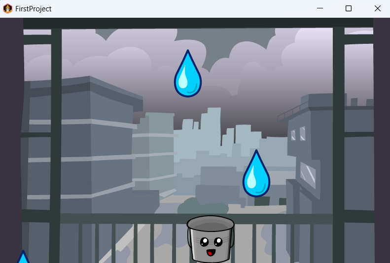

# Rain Catcher Game ☔🪣

A simple 2D game built with LibGDX using Java.  
Move the bucket to catch falling water drops while enjoying sound effects and background music.

---

## 🎮 Features

- Player-controlled bucket
- Falling water drops
- Sound effects and background music
- Keyboard and touch controls
- Random droplet spawning
- Simple collision detection

---

## 🕹️ Controls

| Key | Action |
|---|---|
| Left Arrow | Move Left |
| Right Arrow | Move Right |
| Mouse / Touch | Move Bucket |

---

## 🛠️ Built With

- Java
- LibGDX

---

## 📸 Screenshot





Example project structure:

```text
project-folder/
│
├── screenshots/
│   └── gameplay.png
│
├── assets/
├── core/
└── README.md
```

---

## 🚀 How to Run

1. Clone the repository
2. Open the project in IntelliJ IDEA
3. Run the Desktop Launcher


